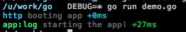

# go-debug

This is a go version of the node module [debug](https://github.com/tj/debug). It don't have all the features that the node module have and it have some own features like `DEBUG_TIME`.

I wanted a package for go of the node version so I wrote it, use it as you like and feel free to contribute!

View the [docs](http://godoc.org/github.com/frozzare/go-personnummer).

## Installation

```
$ go get github.com/frozzare/go-debug
```

## Example

When using `.` before the package you don't have to write `debug.Debug()` just `Debug()`

```go
package main

import . "github.com/frozzare/go-debug"

func main() {

    Debug("http")("booting %s", "app")

    Debug("app:log")("starting the app!")
}
```

When running

```
$ DEBUG=* go run example.go
```

It will output it like this



## Conventions

`go-debug` support the conventions that are described [here](https://github.com/visionmedia/debug#conventions) in the node module [debug](https://github.com/visionmedia/debug).

## Wildcars

`go-debug` support the wildcards that are described [here](https://github.com/visionmedia/debug#wildcards) in the node module [debug](https://github.com/visionmedia/debug).

## Output to file

If you like to output to file and don't want the terminal colors in the file, the best way is to turn off colors with `DEBUG_COLORS`

Example:

```
$ DEBUG_COLORS=0 go run demo.go > out.log &
```

## Output time instead of milliseconds

With `DEBUG_TIME` you can change how the time is written, default is milliseconds. `DEBUG_TIME` can take the values `ms` or `utc` or anything else will be `time.Now()` in Go.

Example:

```
$ DEBUG_TIME=utc DEBUG=*,-fi:* go run demo.go
```


## Tests

There aren't any tests since it's hard to test the output in the terminal with unit tests. But feel free to contribute with tests!

## License

The MIT license for the node module is [here](https://github.com/visionmedia/debug#license), so all credit to them.

The go version is under MIT License just like the node version.
